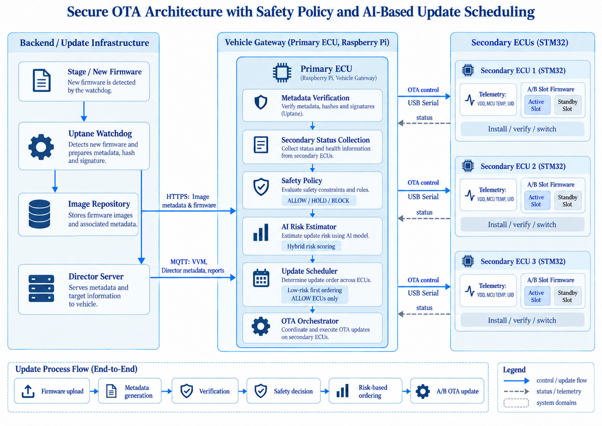

# Safety-First Hybrid AI Secure OTA

### 🖥️ STM32 3대의 A/B 펌웨어 업데이트와 AI 기반 실행 순서 결정

여러 ECU에 새 펌웨어를 언제, 어떤 순서로 설치할 것인가? 이 프로젝트는 구현된 범위의 메타데이터·이미지 검증을 거친 업데이트를 보드 응답에 맞춰 배포하는 과정을 다룬다.

기존 Uptane/TUF 계열 서버·Primary 구조를 확장해, Raspberry Pi Primary ECU와 STM32 Secondary ECU 3대로 실험하도록 구성한 OTA 프로토타입이다. 이 문서의 구현 설명은 저장소 코드와 포함된 산출물을 기준으로 하며, 실물 보드에서의 동작 결과는 별도 실험으로 확인해야 한다.

> 구현 기준: [`adaptive-ai`](https://github.com/26-1-Secure-OTA/OTA_main/tree/adaptive-ai) 브랜치. 서버–Primary는 MQTT·HTTPS, Primary–STM32는 보드별 USB 시리얼로 통신한다. 향후 CAN으로 확장 예정.

[실행 방법](#-실행-방법) · [AI/고정 순서 비교](#ai와-고정-순서-비교) · [테스트](#-하드웨어-없이-검증하기)

## 🚗 프로젝트 배경과 문제

OTA는 장치에 직접 접근하지 않고 펌웨어를 배포할 수 있지만, 잘못된 이미지나 대상 보드의 상태를 확인하지 않은 설치는 장치 운용에 영향을 줄 수 있다. 서명·해시·대상 검증은 무엇을 신뢰하고 어느 ECU에 전달할지 확인하는 출발점이다. 그러나 여러 ECU를 한 번에 갱신할 때는 지금 설치할 수 있는지, 허용된 ECU 중 무엇부터 진행할지, 결과를 어떻게 추적할지도 결정해야 한다.

예를 들어 고정 순서가 `001 → 002 → 003`인데 001의 응답이 계속 느리다면, 다른 보드의 준비 상태가 양호해도 뒤 순서의 설치가 늦어질 수 있다. 이 예시는 문제를 설명하기 위한 가정이며, AI 순서가 실제로 전체 시간을 줄이는지는 별도 실험으로 검증해야 한다.

## 🎯 목표와 검증 질문

> 동일한 메타데이터 검증과 안전 정책 아래에서, Secondary 상태를 반영한 업데이트 순서가 고정 순서보다 배포 진행에 도움이 되는가?

이를 확인하기 위해 세 가지를 구현했다.

1. 서버가 제공한 메타데이터와 이미지를 Primary에서 검증하고, 각 보드의 비활성 A/B 슬롯에 설치하는 업데이트 경로
2. 보드 식별·버전·응답 필드를 검사해 업데이트 허용 여부를 정하는 Safety Policy와, 허용된 보드의 실행 순서만 정하는 하이브리드 AI 스케줄러
3. 추천 순서, 실제 실행 순서, 소요시간, 성공·실패와 슬롯 변화를 남겨 고정 순서와 비교할 수 있는 기록 체계

목표는 AI가 보안·안전 판단을 대체하게 만드는 것이 아니다. 동일한 검증 조건을 유지한 채 순서 결정만 바꾸고, 시간별 완료 ECU 수·전체 소요시간·실패 결과를 비교하는 것이다. 현재 시리얼 전송 경로는 자동 재시도를 수행하지 않고 `retry_count=0`을 기록한다. 순서 변경의 성능 이점은 아직 입증된 결과가 아닌 평가 과제이다.

## 🏗️ 시스템 구성



위 그림은 구성요소와 데이터 흐름을 나타낸 개념도다. 실제 검증 범위와 보드 응답의 의미는 아래 구현 설명과 ‘한계’ 절을 기준으로 확인한다.

서버는 펌웨어를 배포하고, Raspberry Pi Primary는 메타데이터와 보드 응답을 검사한 뒤 실행 순서를 정하며, STM32 Secondary 3대는 각각 비활성 A/B 슬롯에 새 펌웨어를 기록하도록 구현돼 있다. MQTT는 VVM·Director 메타데이터·보고에, HTTPS는 Image Repository의 메타데이터·펌웨어 다운로드에 사용한다. Primary와 보드들은 USB 시리얼로 연결한다.

| 구성 요소 | 역할 |
|---|---|
| 배포 Watchdog | 배포 디렉터리의 펌웨어를 검사하고 업데이트 카탈로그 생성 |
| Director Repository | Primary가 전송한 서명된 VVM의 버전을 기준으로 대상별 업데이트 메타데이터 생성 |
| Image Repository | 메타데이터와 펌웨어 파일 제공 |
| Primary ECU | 검증, 보드 상태 수집, 안전 정책, AI 순서 결정, 전송 및 결과 기록 |
| STM32 Secondary ECU × 3 | 상태 응답, 비활성 슬롯 기록, 재부팅 및 새 펌웨어 실행 |

🛠️ 기술 구성: Python · C · STM32F103RB · STM32CubeIDE/HAL · Raspberry Pi · MQTT · HTTPS/Flask · scikit-learn · JSONL

## 🗺️ 설계 선택과 이유

| 선택 | 이유 |
|---|---|
| Safety Policy → AI 순서 | 허용·보류·차단 판단을 명시적 규칙으로 유지하고, AI에는 허용된 ECU의 순서 결정만 맡긴다. |
| Isolation Forest + 방향성 점수 | 실패 사례가 부족해 정상 전압·온도 분포로 물리적 이상을 찾고, 응답 지연·이미지 점유율·과거 실패는 각각 위험이 커지는 방향으로 계산한다. |
| A/B 슬롯 + 위험도 기반 순서 | 실행 중인 슬롯을 보존하고, 안전 정책을 통과한 ECU를 위험도가 낮은 순서로 업데이트한다. |

낮은 위험도부터 실행하는 것은 안정적인 ECU부터 완료시키려는 설계 가정이다. 실제 개선 효과와 장애별 복구 범위는 반복 실험으로 확인해야 한다.

## 🔧 핵심 구현

### 1. 메타데이터 검증과 안전 정책

Director와 Image Repository를 분리한 Uptane/TUF 계열 구조다. Primary는 Director 메타데이터의 서명과 버전 연결을 확인하고, Image 메타데이터의 서명·timestamp 만료·snapshot 해시를 검사한다. 이어 Director/Image 대상의 해시·길이·슬롯 정보를 대조하고 다운로드한 파일의 해시·길이·링크 슬롯을 확인한다. 모든 Uptane/TUF 메타데이터 규칙을 구현한 것은 아니다. 현재 만료 검사는 Image timestamp에 한정되고, Image targets의 snapshot 참조 버전도 검사하지 않는다.

Primary는 등록된 UID, 보드가 응답한 현재 버전, 대상 슬롯, `READY`·`HEALTH` 응답, UART 오류와 응답시간을 검사해 `ALLOW`, `HOLD`, `BLOCK`을 결정한다. Director의 입력인 `Primary_ECU/vvm.json`은 저장소 기준 STM32 세 대를 모두 `0.0.0`으로 기록한 시험용 VVM이다. Primary는 시작할 때 이 파일을 그대로 전송하며 시리얼 업데이트 후 자동으로 갱신하지 않는다. 따라서 Director의 버전 비교를 실제 보드 버전 확인으로 해석할 수 없다. 동일·하위 버전 설치의 최종 차단에는 업데이트 직전 보드 STATUS의 버전을 사용한다.

- `ALLOW`: 현재 검사 조건을 통과해 업데이트 대상으로 진행한다.
- `HOLD`: 보드 미응답, 준비 미완료 등으로 실행을 보류한다.
- `BLOCK`: 보드 식별 불일치, 검증 실패, 일반 업데이트에서의 동일·하위 버전 설치 등으로 실행을 차단한다.

AI는 `ALLOW` 집합 안에서 순서를 계산한다. 온도와 공급전압은 현재 안전 정책의 직접적인 허용·차단 임계값으로 사용하지 않으며, AI 위험도 계산에 활용한다. 응답시간은 AI 입력이면서 안전 정책의 응답 지연 검사에도 사용된다. 현재 STM32 애플리케이션은 `READY=1`을 고정 출력하고, `HEALTH=OK`는 `POST_REBOOT_HEALTH_FAIL` 오류 주입 때만 `ERROR`로 바꾼다. 이 두 필드 검사는 실측 준비도나 종합적인 건강 진단을 뜻하지 않는다.

### 2. STM32 A/B 슬롯 업데이트

각 보드는 Bootloader와 두 애플리케이션 슬롯을 사용한다. 세 보드가 공통 프로젝트 소스를 사용하며, 빌드 설정으로 ECU ID와 펌웨어 버전을 지정한다.

| 영역 | 시작 주소 | 역할 |
|---|---|---|
| Bootloader | `0x08000000` | 부트 플래그와 애플리케이션 벡터 테이블을 확인하고 슬롯 선택 |
| Slot A | `0x08004000` | A 위치에 링크된 애플리케이션 |
| Slot B | `0x08010000` | B 위치에 링크된 애플리케이션 |

각 애플리케이션 슬롯의 펌웨어 최대 크기는 48 KiB이다. 배포 시에는 같은 ECU·같은 버전에 대한 A/B 바이너리를 함께 준비한다.

```text
현재 Slot A 실행 → Slot B 펌웨어 검증·전송 → 재부팅 → Slot B·새 버전 확인
현재 Slot B 실행 → Slot A 펌웨어 검증·전송 → 재부팅 → Slot A·새 버전 확인
```

Primary는 파일명, 메타데이터의 대상 슬롯, 바이너리의 Reset_Handler 주소를 교차검증하고 전송 직전에도 보드 상태를 다시 확인한다. 재부팅 후에는 응답한 ECU ID·UID·슬롯·버전·`HEALTH` 값을 검사한다. `BOOT_FAILED` 오류 주입 시 Bootloader가 이전 슬롯으로 돌아가는 시험 경로를 제공한다. Bootloader의 슬롯 유효성 검사는 초기 스택 포인터와 Reset_Handler 주소를 확인하는 수준이며 이미지 해시나 실행 중 기능의 정상 여부까지 검증하지 않는다. 일반적인 사후 오류에서의 자동 슬롯 복귀와 임의의 전원 차단을 포함한 모든 장애에서의 복구는 입증되지 않았다.

### 3. 보드 상태 수집과 5개 위험도 입력

상태 수집 계층은 15개 항목을 다루며, 현재 업데이트 순서 결정에는 아래 5개를 선택했다. 센서값, 통신 측정값, 펌웨어 크기, 과거 실행 이력을 함께 사용한다.

| 입력값 | 측정·산출 방법과 선정 이유 | 위험도 반영 |
|---|---|---|
| `supply_voltage_mv` | 내부 기준전압의 ADC 측정으로 MCU 공급전압을 추정해 전원 상태 반영 | 온도와 함께 Isolation Forest 입력 |
| `temperature_c` | 내부 온도센서의 ADC 값을 환산해 MCU 열적 상태 반영 | 전압과 함께 Isolation Forest 입력 |
| `link_response_ms` | Primary에서 상태 요청·응답 시간을 측정해 통신 상태 반영 | 정상 기준보다 느린 정도 반영 |
| `image_size_ratio` | 이미지 크기 ÷ 대상 슬롯 최대 크기로 상대적인 설치 부담 표현 | 점유율이 클수록 높은 점수 |
| `previous_failures` | 보드별 최근 유효 이력에서 실패 횟수를 집계해 과거 수행 이력 반영 | 실패 횟수가 많을수록 높은 점수 |

온도는 MCU 내부 온도이며 주변 공기 온도와 다르다. 공급전압은 내부 기준값으로 계산한 추정치로, USB 입력 전압이나 배터리 잔량을 의미하지 않는다. `image_size_ratio`는 배포 이미지의 슬롯 점유율이다.

각 항목은 순서 결정을 위한 입력으로 선정했다. 특히 이미지 점유율을 설치 부담의 지표로 사용하는 것은 설계 가정이며, 큰 점유율이 실제 실패를 유발한다는 인과관계를 입증한 것은 아니다.

### 4. 하이브리드 AI 스케줄러

정상 데이터로 학습한 `scikit-learn`의 🌲Isolation Forest가 공급전압·온도 조합의 이상도를 계산한다. 나머지 세 입력은 위험이 증가하는 방향에 맞춰 점수화한 뒤 가중 합산한다.

```text
최종 위험도 = 0.40 × 전압·온도 이상도
            + 0.30 × 응답 지연 점수
            + 0.15 × 이미지 슬롯 점유율
            + 0.15 × 과거 실패 점수
```

| 구성 점수 | 계산 방식 |
|---|---|
| 전압·온도 이상도 | `RobustScaler → Isolation Forest`의 이상 점수를 정상 학습 데이터의 백분위 기준으로 0~1 변환 |
| 응답 지연 | `clip((응답시간 − 정상 중앙값) / (1000ms − 정상 중앙값), 0, 1)` |
| 이미지 점유율 | `image_size_ratio` 그대로 사용 |
| 과거 실패 | `min(previous_failures / 3, 1)` |

`clip(x, 0, 1)`은 결과를 0~1 범위로 제한하는 연산이다. 정상 중앙값보다 빠른 응답에는 지연 점수를 더하지 않는다. `previous_failures`는 기본 설정에서 최근 10개의 유효 이력을 사용한다.

최종 점수는 업데이트 순서를 비교하기 위한 상대 위험도이다. 정상 학습 데이터의 백분위를 사용하는 항목은 전압·온도 이상도이며, 최종 점수 전체를 정상 분포와의 거리로 해석하지 않는다. 가중치 `0.40 / 0.30 / 0.15 / 0.15`는 초기 실험을 위해 정한 휴리스틱 값으로, 실험을 통해 최적화한 값은 아니다. 낮은 점수의 ECU부터 실행하고, 동점이면 기존 고정 순서를 유지한다.

- 기본 `ACTIVE` 모드에서는 계산된 추천 순서를 실제 업데이트 순서로 사용한다. `SHADOW` 모드는 추천만 기록하고 고정 순서로 설치한다.
- 모델 로딩·추론 실패: 사유를 기록하고 허용된 ECU를 `001 → 002 → 003` 순서로 처리한다.

### 5. 실행 데이터 축적과 모델 갱신

초기 정상 데이터는 3개 보드 × 30회 수집 × 보드별 5회 측정 = 원시 측정 450건이다. 이를 보드·수집 회차별로 집계한 90행을 초기 모델 학습에 사용했다. 원시 센서·응답 측정과 실제 OTA 성공·실패 이력은 다른 데이터이다.

캠페인은 시작 시점의 측정값과 모델로 순서를 정한다. 종료 후에는 학습 조건을 만족하는 신규 데이터가 30건 쌓일 때 보드별 최근 100건을 사용해 모델을 다시 학습하며, 새 모델은 다음 캠페인부터 적용된다.

재학습에는 `BOARD` 출처, 정상 시나리오, 정책 통과, 업데이트 성공 등 코드의 적격 조건을 만족한 데이터만 사용한다. `telemetry_valid`, `power_good`, `HEALTH=OK`도 요구하며, 물리 이상도가 0.95를 초과한 데이터와 오류 주입·시뮬레이터·실패 데이터는 제외한다. 여기서 `HEALTH`는 위에서 설명한 STM32 응답 필드로, 독립적인 기능 진단 결과는 아니다.

모델 파일과 함께 입력 스키마, 학습 데이터 해시, 모델 해시, 가중치, 라이브러리 버전을 저장해 실행 당시의 판단 기준을 추적한다.

## 🚀 실행 방법

아래 절차는 노트북의 Ubuntu WSL에서 서버 구성요소를 실행하고, Raspberry Pi에서 Primary를 실행하며, STM32 3대를 Raspberry Pi에 USB로 연결하는 환경을 기준으로 한다. 명령 예시는 **서버와 Raspberry Pi 양쪽의 `~/OTA_main`에 저장소를 복제한 경우**이다. 다른 위치에 복제했다면 각 `cd ~/OTA_main...` 경로를 실제 절대 경로로 바꾼다. 코드가 상대 경로로 인증서와 메타데이터를 찾으므로 각 프로그램은 표시된 디렉터리에서 실행한다.

### 1. 저장소와 Python 패키지 준비

서버와 Raspberry Pi에 같은 브랜치를 준비한다. 다음 명령을 **두 기기에서 각각** 실행한다. 가상환경을 쓰면 저장된 모델이 요구하는 라이브러리 버전을 시스템 Python과 분리할 수 있다.

```bash
cd ~
git clone --branch adaptive-ai https://github.com/26-1-Secure-OTA/OTA_main.git
cd OTA_main
```

```bash
cd ~/OTA_main
python3 -m venv .venv
source .venv/bin/activate
python3 -m pip install --upgrade pip
python3 -m pip install -r Primary_ECU/requirements-ai.txt
python3 -m pip install paho-mqtt requests Flask watchdog pyserial cryptography ecdsa
```

이후 새 터미널에서도 `source ~/OTA_main/.venv/bin/activate`를 실행한다. `venv` 모듈이 없다면 운영체제의 `python3-venv` 패키지를 준비한다. AI 모델은 `Primary_ECU/models/isolation-forest-v2.metadata.json`에 기록된 scikit-learn 버전과 실행 환경의 버전이 일치해야 한다.

이미 저장소가 있다면 다시 clone하기 전에 현재 브랜치와 로컬 변경사항을 확인한다.

```bash
git branch --show-current
git status --short
```

### 2. MQTT Broker, 키·인증서와 네트워크 주소 준비

메타데이터 서명키와 MQTT·HTTPS 인증서는 서로 다른 용도이다. 다음 디렉터리의 서명키·CA·서비스 인증서·클라이언트 인증서가 서로 호환되는 실험 환경용으로 준비돼 있어야 한다.

```text
OTA_Director_Server/keys/
OTA_Director_Server/src/utils/certs/
Director/keys/
Director/src/utils/certs/
Primary_ECU/utils/certs/
```

서버에서 **TLS와 클라이언트 인증서를 요구하는 MQTT Broker**를 포트 `8883`에 먼저 준비한다. 저장소에는 Broker 실행 설정이 없으므로, 다음은 Ubuntu WSL에서 Mosquitto를 사용하는 실험용 예시이다. 이미 Broker가 있다면 해당 Broker의 CA·서버 인증서·클라이언트 인증서가 서로 맞는지 확인하고 이 예시는 건너뛴다.

```bash
sudo apt update
sudo apt install mosquitto

cd ~/OTA_main
repo_dir="$PWD"
cat > /tmp/ota-mosquitto.conf <<EOF
listener 8883 0.0.0.0
allow_anonymous false
cafile $repo_dir/OTA_Director_Server/src/utils/certs/ca.crt
certfile $repo_dir/OTA_Director_Server/src/utils/certs/mqtt_server.crt
keyfile $repo_dir/OTA_Director_Server/src/utils/certs/mqtt_server.key
require_certificate true
use_identity_as_username true
EOF
mosquitto -c /tmp/ota-mosquitto.conf -v
```

이 명령은 별도 서버 터미널에서 일반 사용자로 실행하고, 인증서 파일을 그 사용자가 읽을 수 있어야 한다. 포함된 인증서는 특정 실험 주소용이다. 새 네트워크에서 서버 신원을 검증하려면 사용 주소가 SAN에 포함된 인증서로 교체하고 클라이언트의 `tls_insecure_set(True)` 설정도 수정해야 한다. 현재 HTTPS 다운로드는 `verify=False`로 인증서 검증을 하지 않는다. 인증서 유효기간과 SAN은 `openssl x509 -in OTA_Director_Server/src/utils/certs/mqtt_server.crt -noout -dates -ext subjectAltName`으로 확인할 수 있다.

Broker 주소와 포트는 다음 세 파일에서 동일하게 설정한다. 현재 기본 주소는 특정 실험 네트워크용이므로 자신의 서버 주소로 바꿔야 한다.

| 파일 | 설정값 |
|---|---|
| `OTA_Director_Server/src/Image.py` | `MQTT_BROKER`, `MQTT_PORT` |
| `Director/config.py` | `MQTT_BROKER`, `MQTT_PORT` |
| `Primary_ECU/Primary.py` | `BROKER`, `PORT` |

Image Repository 주소에는 Raspberry Pi에서 접근할 수 있는 서버 주소를 사용한다. Raspberry Pi에서 `localhost`는 Raspberry Pi 자신을 가리키므로 사용할 수 없다. WSL에서 서비스를 실행한다면 Windows 방화벽과 WSL 포트 전달도 확인한다.

```bash
export IMAGE_REPOSITORY_URL=https://SERVER_LAN_IP:8443
```

Raspberry Pi에서 서버의 MQTT와 HTTPS 포트에 접근 가능한지 확인한다.

```bash
nc -vz SERVER_LAN_IP 8883
nc -vz SERVER_LAN_IP 8443
```

위 명령의 `SERVER_LAN_IP`는 실제 주소로 교체한다. 포트 연결 확인은 서비스가 실행 중일 때 수행한다.

### 3. STM32 연결과 UID 확인

세 보드에는 각각 Bootloader와 초기 애플리케이션이 기록돼 있어야 한다.

| 프로젝트 | 시작 주소 |
|---|---:|
| `OTA_BOOTLOADER` | `0x08000000` |
| `OTA_LED_A_TEST` | `0x08004000` |
| `OTA_LED_B_TEST` | `0x08010000` |

Raspberry Pi에 보드 3대를 연결한 뒤 시리얼 장치와 상태를 확인한다.

```bash
ls -l /dev/ttyACM*
ls -l /dev/serial/by-id/

cd ~/OTA_main/Primary_ECU
source ../.venv/bin/activate
python3 status_check.py
```

출력된 `ecu_serial`과 96비트 `uid`가 `Primary_ECU/config/secondary_registry.json`의 `stm32-led-001`, `002`, `003`과 일치하는지 직접 확인한다. 포트 번호만으로 보드를 구분하지 않는다. 출력된 각 보드의 `version`과 `active_slot`도 기록한다. 저장소의 서명된 `Primary_ECU/vvm.json`은 세 STM32를 `0.0.0`으로 기록한 시험용 파일이며 이 상태 조회 결과를 반영하지 않는다.

### 4. 펌웨어 6개 준비

하나의 새 버전에는 보드별 Slot A/B 바이너리가 모두 필요하다.

```text
stm32-led-001_<VERSION>_slot_a.bin
stm32-led-001_<VERSION>_slot_b.bin
stm32-led-002_<VERSION>_slot_a.bin
stm32-led-002_<VERSION>_slot_b.bin
stm32-led-003_<VERSION>_slot_a.bin
stm32-led-003_<VERSION>_slot_b.bin
```

파일 이름만 바꾸지 말고 실제 펌웨어의 ECU ID, 버전, 링크 주소를 맞춰 빌드한다. 배포 버전은 각 보드가 STATUS로 응답한 현재 버전보다 높아야 한다. 포함된 정상 상태 수집 데이터의 보드 버전은 모두 `2.3.0`이므로, 그 상태의 보드에는 아래 `2.3.0` 예시 파일을 업데이트로 사용할 수 없다.

### 5. 서버 구성요소 실행

MQTT Broker를 먼저 시작한 뒤, 서버의 **서로 다른 터미널**에서 다음 프로그램을 실행한다. 각 코드 블록은 어느 디렉터리에 있든 독립적으로 실행할 수 있다.

```bash
# 터미널 1: 배포 Watchdog
cd ~/OTA_main/OTA_Director_Server/src
source ../../.venv/bin/activate
python3 uptane_watchdog.py
```

```bash
# 터미널 2: Image Repository
cd ~/OTA_main/OTA_Director_Server/src
source ../../.venv/bin/activate
export IMAGE_REPOSITORY_URL=https://SERVER_LAN_IP:8443
python3 Image.py
```

```bash
# 터미널 3: Director
cd ~/OTA_main/Director
source ../.venv/bin/activate
python3 Director.py
```

`SERVER_LAN_IP`를 실제 주소로 교체한다. Watchdog와 Image Repository가 실행된 다음 서버의 **네 번째 터미널**에서 새 펌웨어 6개를 `OTA_Director_Server/src_add/stage/`에 복사한다. 아래 `2.3.0`은 저장소에 포함된 예시이며, STATUS에서 확인한 모든 대상 보드의 현재 버전보다 높을 때만 사용한다.

```bash
cd ~/OTA_main
cp OTA_Director_Server/src_add/firmware_storage/2.3.0/stm32-led-*.bin \
  OTA_Director_Server/src_add/stage/
```

Watchdog가 targets를 갱신·서명하고 Image Repository가 snapshot과 timestamp를 갱신하는지 로그에서 확인한다. Watchdog 실행 전에 이미 `stage/`에 있던 파일이나 같은 이름으로 덮어쓴 파일은 새 파일 생성 이벤트가 발생하지 않을 수 있다.

### 6. Raspberry Pi에서 Primary 실행

```bash
cd ~/OTA_main/Primary_ECU
source ../.venv/bin/activate
python3 Primary.py
```

Primary는 저장된 VVM을 전송하고, 위에 명시한 범위에서 Director와 Image Repository 메타데이터를 검증한 다음 STM32 상태를 수집한다. 안전 정책에서 허용된 보드는 계산된 위험도가 낮은 순서로 업데이트하며, 모델을 사용할 수 없으면 `001 → 002 → 003` 순서로 처리한다. Director는 저장된 VVM의 `0.0.0`을 기준으로 후보를 만들지만, Primary의 정책은 보드에서 다시 읽은 실제 버전을 기준으로 동일·하위 버전을 차단한다. 시리얼 업데이트 후 VVM을 현재 보드 상태에 맞게 재생성·재서명하는 자동 경로는 없다.

일반 업데이트에서는 동일하거나 낮은 버전의 설치를 차단하므로, 업데이트를 다시 실행하려면 보드의 현재 버전보다 높은 새 펌웨어가 필요하다.

### AI와 고정 순서 비교

Primary 실행 전 환경변수로 순서 결정 방식을 선택할 수 있다. 세 설정 모두 같은 메타데이터 검증과 Safety Policy를 거친다.

| 목적 | 실행 명령 | 실제 설치 순서 |
|---|---|---|
| 고정 순서 기준선 | `OTA_AI_MODE=OFF python3 Primary.py` | 허용된 ECU를 `001 → 002 → 003` 순서로 실행 |
| AI 추천만 기록 | `OTA_AI_MODE=ISOLATION_FOREST OTA_AI_APPLY_MODE=SHADOW python3 Primary.py` | 추천 순서를 기록하고 설치는 고정 순서로 실행 |
| AI 순서 적용 | `OTA_AI_MODE=ISOLATION_FOREST OTA_AI_APPLY_MODE=ACTIVE python3 Primary.py` | 허용된 ECU를 위험도가 낮은 순서로 실행 |

명령은 Raspberry Pi의 `~/OTA_main/Primary_ECU`에서 가상환경을 활성화한 뒤 실행한다. 설정을 생략하면 `ISOLATION_FOREST`와 `ACTIVE`가 기본값이다. 각 실행은 별도 캠페인이다. 동일 버전 재설치는 일반 업데이트에서 차단되므로, 실제 비교 실험에서는 각 캠페인에 현재 보드 버전보다 높은 펌웨어를 준비하고 시작 상태·VVM 상태·네트워크 조건을 기록한다. 모델 로딩·추론에 실패하면 `[AI Scheduler]`의 `used=OFF`와 `fallback` 사유를 확인한다.

### 7. 실행 결과 확인

콘솔의 `[AI Scheduler]`에서 사용된 모델, 추천 순서, 실제 실행 순서와 fallback 사유를 확인한다. 보드별 상세 결과는 다음 파일에 기록된다.

```text
Primary_ECU/logs/ota_experiments.jsonl
```

같은 `campaign_id`의 `policy_decision`, `ai_risk_score`, `ai_recommended_rank`, `ai_execution_rank`, `update_attempted`, `success`, 업데이트 전후 버전과 슬롯을 함께 확인한다. 완료 후 `python3 status_check.py`를 다시 실행해 실제 보드 버전과 슬롯이 변경됐는지 검증한다.

### ⚠️ 실행 중 자주 확인할 문제

| 증상 | 확인할 항목 |
|---|---|
| `No route to host` | Broker 주소, 같은 네트워크 연결, 8883 포트와 방화벽 |
| HTTPS 연결 실패 | `IMAGE_REPOSITORY_URL`, 8443 포트, WSL 포트 전달 |
| STM32를 찾지 못함 | `/dev/ttyACM*`, USB 케이블, `dialout` 권한 |
| `UNKNOWN_SECONDARY` | 실제 UID와 `secondary_registry.json` |
| `DOWNGRADE_ATTEMPT` | 대상 메타데이터의 버전과 현재 보드 STATUS 버전; 펌웨어 내부 버전은 재부팅 뒤 별도로 확인 |
| `INVALID_TARGET_SLOT` | 현재 슬롯, 파일명 슬롯, 메타데이터 슬롯과 링크 주소 |
| 고정 순서로 실행됨 | 모델 경로, AI 의존성 버전, `[AI Scheduler]`의 fallback 사유 |

## 🧪 하드웨어 없이 검증하기

Python 패키지를 설치한 뒤 각 디렉터리에서 테스트를 실행한다. Primary 테스트는 `ai`와 `ecu` 패키지를 찾을 수 있도록 **`Primary_ECU/`에서** 시작한다.

```bash
cd ~/OTA_main/Primary_ECU
source ../.venv/bin/activate
python3 -m unittest discover -s tests -v
```

```bash
cd ~/OTA_main
source .venv/bin/activate
python3 -m unittest discover -s STM32_Workspace/tests -v
```

첫 번째 명령에서 `SKLEARN_VERSION_MISMATCH`가 나타나면 실행 중인 Python 환경의 scikit-learn 버전과 모델 메타데이터를 확인하고 `Primary_ECU/requirements-ai.txt`의 고정 버전을 설치한다. 실험 계획만 확인하려면 다음 명령을 사용할 수 있다. 실제 보드 업데이트와 오류 주입 실행 방법은 [실험 문서](Primary_ECU/experiments/README.md)에 있다.

```bash
cd ~/OTA_main/Primary_ECU
source ../.venv/bin/activate
python3 experiments/scenario_runner.py --dry-run
```

2026-09-26에 위 고정 AI 의존성과 추가 Python 패키지를 설치한 격리 환경에서 Primary 테스트 57개와 STM32 테스트 5개가 모두 통과했고, dry-run은 20개 캠페인·60개 시도를 출력했다. 이 테스트와 dry-run은 펌웨어를 보드에 기록하지 않는다. 실제 USB 통신, 재부팅, A/B 슬롯 전환은 별도의 하드웨어 실행으로 확인한다.

## 📊 판단 결과 확인

캠페인 실행 시 Primary는 `[AI Scheduler]` 로그에 요청 모드, 실제 사용 모드, 추천 순서, 실행 순서, fallback 사유를 출력한다. 새 캠페인의 `Primary_ECU/logs/ota_experiments.jsonl` 행에는 보드별 정책 결과, 위험도 구성 점수, 추천·실행 순위, 모델 버전·해시, 설치 소요시간, 성공 여부, 업데이트 전후 슬롯을 기록한다. 기존 로그에는 이전 스키마의 행도 남아 있을 수 있으므로 비교할 때 `campaign_id`와 필드 유무를 확인한다.

실제 캠페인 결과표와 시연 영상·사진은 촬영 자료를 정리한 뒤 이 절에 추가한다.

## 🔒 구현 현황과 검증 범위

| 항목 | 현재 범위 |
|---|---|
| 시험 구성 | Raspberry Pi Primary와 STM32 Secondary 3대를 USB 시리얼로 연결하도록 구성. 현재 연결·동작 여부는 실행 환경에서 별도 확인 필요 |
| 업데이트 경로 | 위에 적은 범위의 메타데이터 검증, UID 확인, A/B 전송 및 재부팅 후 STATUS 확인 로직 구현 |
| AI | 5개 입력을 사용하는 하이브리드 위험도와 낮은 위험도 우선 순서 구현 |
| 초기 모델 | 모델 메타데이터 기준 원시 측정 450건을 집계한 정상 데이터 90행으로 학습 |
| 모델 갱신 | 정상·성공 데이터 조건부 수집과 배치 재학습 로직 구현. 실제 재학습 횟수는 실험 결과 확인 필요 |
| 오류 주입 | 지연, 전송 중단·손상, 리셋, 부팅 실패 등을 설정하는 프로토콜과 실험 실행기 구현 |

실험 실행기는 기본적으로 20개 캠페인 × 3개 보드 = 60회 시도의 계획을 제공한다. 이는 20대의 실물 보드를 의미하지 않는다. 온도·전압 오류 주입 시나리오는 보고값을 변경하는 시험을 포함하므로 실제 가열·전원 변동 시험과 구분한다.

후속 평가에서는 동일한 조건에서 고정 순서와 AI 순서를 비교하고, 시간별 완료 ECU 수, 전체 완료 시간, 실패·복구 결과를 기록한다. 현재 문서는 성능 개선을 주장하지 않는다.

## ⚠️ 한계

현재 프로젝트는 3보드 연구·시연용 프로토타입이다. 저장된 VVM은 실제 보드 버전과 자동 동기화되지 않는다. `READY`는 고정 응답이고 평상시 `HEALTH`도 기능 진단 결과가 아니다. 재부팅 후 STATUS 검사와 `BOOT_FAILED` 시험용 복귀 경로가 있지만, 일반적인 실행 장애에서 자동 복귀한다고 보장하지 않는다. 차량 실환경 적용, CAN/Ethernet 연결, 센서 보정, 물리적 장애 시험은 확장 과제이다.

## 🗂️ 저장소 둘러보기

```text
OTA_main/
├── Director/                     # 대상별 업데이트 메타데이터
├── OTA_Director_Server/
│   ├── src/                      # 배포 Watchdog · Image Repository
│   ├── src_add/                  # 펌웨어 준비·배포 디렉터리
│   └── Image_Repo/                # 메타데이터·이미지 저장소
├── Primary_ECU/
│   ├── ai/                       # 학습·추론·위험도·재학습
│   ├── ecu/                      # 검증·정책·설치·상태·로그
│   ├── config/                   # 보드 UID 등록
│   ├── models/                   # 모델과 메타데이터
│   ├── experiments/              # 오류 주입 실험 실행·검증
│   └── tests/                    # 정책·AI·프로토콜 테스트
└── STM32_Workspace/
    ├── OTA_BOOTLOADER/            # 부팅 슬롯 선택
    ├── OTA_LED_A_TEST/            # Slot A 애플리케이션
    ├── OTA_LED_B_TEST/            # Slot B 애플리케이션
    ├── Common/                    # 공통 오류 주입 프로토콜
    └── firmware/                  # 버전별 빌드 산출물
```

설계를 자세히 볼 때는 `Primary_ECU/ecu/safety_policy.py`, `Primary_ECU/ai/hybrid_risk.py`, `Primary_ECU/ai/adaptive_model.py`, `STM32_Workspace/OTA_LED_A_TEST/Src/main.c`부터 살펴보면 된다.

## 📚 팀과 문서

팀 : KUSE 2026-1 Secure OTA 팀

- [STM32 워크스페이스 설명](STM32_Workspace/README.md)
- [오류 주입 실험 설명](Primary_ECU/experiments/README.md)
- [AI 의존성 버전](Primary_ECU/requirements-ai.txt)
